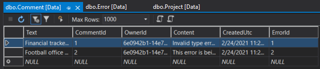

# BUG TRACKER    
---

**Description:** 
Bug Tracker is a WebAPI created using [ASP.NET](https://dotnet.microsoft.com/apps/aspnet). The purpose of this program is to track the various errors (bugs) encountered with program creation. These bugs can be found when building the code, running the program, github or file creation errors.  

**Requirements:** 
Bug Tracker was created using Microsoft’s Visual Studio Community 2019 and will be required to open this solution once cloned from Github. 

**Installing:** 
To clone this solution, click the link below or enter the following link into your browser: https://github.com/14andersonr/BugTracker

This will take you to the BugTracker repository on Github. From here use the green *Code* button drop down menu to copy the URL for cloning. Use the command line on your local machine to create a local repository and follow the steps in the reference link to clone the project.  
[GitHub Docs](https://docs.github.com/en/github/creating-cloning-and-archiving-repositories/cloning-a-repository)

**Possible Install Issues:** 
If any issues occur after cloning, try using F6 (build) to see if the compiler will correct them. This may take a couple times but should self correct. Several NuGet packages are used in this solution including but not limited to the following:
- Microsoft.AspNet.Identity.EntityFramework
- Microsoft.AspNet.Identity.Owin
- Microsoft.AspNet.WebApi.Owin

Verify these are intact. If not, navigate to the solution explorer and right click on the solution. Choose *Restore NuGet Packages*. 

**Usage:** 
This program can be used to track all the errors (bugs) created when making a program. The following images below are the data tables holding the entries provided by the user. 
 

After creating a login with a username and password, the API can be accessed using a 3rd party software like [Postman](https://www.postman.com/). The user can enter the type of error which is associated with a program as well as leave comments for future reference. Navigating to the Help page of the Api once running will show the various endpoints and the requirements needed to access them. 

**Authors:** 
Bug Tracker is a collaboration created by:
- Meaza Tesfaye
- Richard Anderson
- Keith Anderson

References:
https://developer.mozilla.org/en-US/docs/Learn/JavaScript/Client-side_web_APIs/Introduction (This is a great resource for basic knowledge of what an API is and how it works.)

https://docs.microsoft.com/en-us/ef/core/modeling/inheritance (This was a very helpful resource to learn about how Entity Framework maps the inheritance classes using the table-per-hierarchy (TPH) pattern.)

